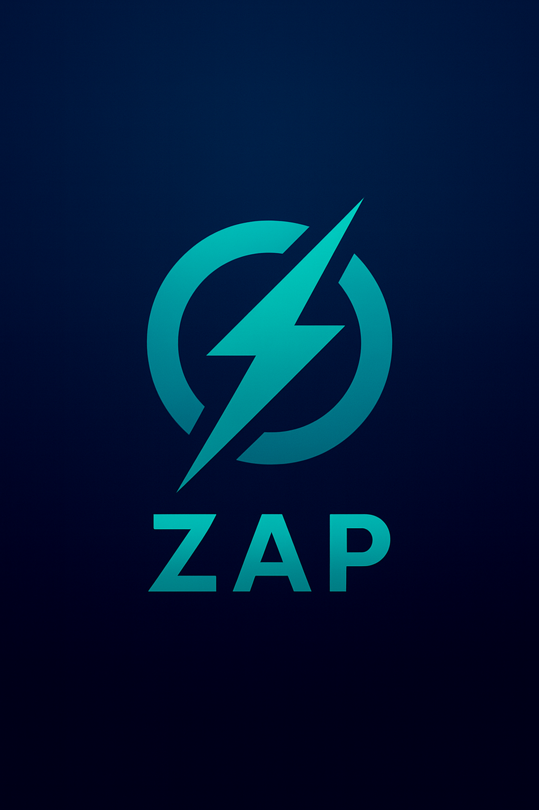

<div align="center">
  
</div>

## ⚡ zap

**AI-Powered Git Workflow Reimagined**

Zap is a next-generation interface for Git that keeps full compatibility with `.git/`,  
but adds an intelligent AI layer to make version control faster, safer, and easier.

Built in **Zig** for performance and portability. Powered by your **local GPU + Switchboard AI router**  
for blazing-fast, private, context-aware assistance.

---

## ✨ Features

- **Smart Commits**  
  - Auto-generate Conventional Commit messages from diffs.  
  - Learns your repo’s style (`.zap.toml`).  

- **Explain & Summarize**  
  - `zap explain` turns commit ranges or diffs into clear English.  
  - Great for code review or onboarding.  

- **Merge Assistance**  
  - Detects conflicts, proposes minimal patch suggestions.  
  - Explains risk before you accept changes.  

- **Changelog Automation**  
  - `zap changelog` builds release notes from commit history.  

- **Repo Review**  
  - `zap review` highlights issues, secrets, or policy violations.  
  - Can escalate to cloud models (Claude/OpenAI) if needed.  

- **Safe Sync**  
  - `zap sync` previews incoming changes before pulling/merging.  

---

## 🔧 Installation

```bash
# clone the repo
git clone https://github.com/ghostkellz/zap.git
cd zap

# build with zig
zig build -Drelease-safe

# symlink into PATH
ln -s $(pwd)/zig-out/bin/zap /usr/local/bin/zap
```

---

## ⚡ Quick Start

```bash
# stage changes as normal
git add .

# let zap generate commit message
zap commit -a

# explain changes in plain English
zap explain HEAD~3..HEAD

# assist with conflicts
zap merge --assist

# generate changelog since last tag
zap changelog v0.7.2..HEAD
```

---

## ⚙️ Configuration

Create a `.zap.toml` in your repo:

```toml
[style]
type_scope_required = true
imperative = true
max_subject_len = 72

[policies]
allow_cloud = false
block_secrets = true
require_tests_on = ["feat","fix","refactor"]

[routing]
prefer_local = true
escalate_on_long_ctx = true
```

---

## 🧠 How It Works

### Local-First AI
Uses Ollama models on your GPU for speed and privacy.

### Hybrid Escalation
Seamlessly escalates to Claude/OpenAI when needed.

### Context Packers
Git diffs, commit history, and style profiles are compacted
into an efficient context before each query.

### Semantic Cache
Stores embeddings and previous answers in zQLite for instant re-use.

---

## 📍 Roadmap

- [ ] `zap guard` → CI/CD pre-commit & security checks
- [ ] Multi-repo awareness (monorepo mode)
- [ ] Semantic diffs (code-aware hunks)
- [ ] Repo health score (tests, deps, bus factor)
- [ ] Optional Zap-native DVCS layer (beyond Git)

---

## 📜 License

MIT © 2025 CK Technology LLC / GhostKellz
